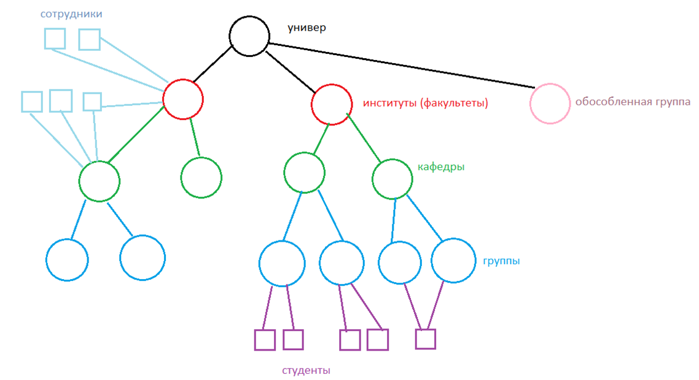

# Лента объявлений

Структура университета представляет иерархическую структуру: университет, институты, кафедры, группы. Иерархические
структуры удобно хранить в деревьях, где каждый узел будет хранить список пользователей, относящихся к нему. Таким
образом, узлы-группы будут содержать студентов и кураторов, узлы-кафедры - сотрудников кафедр и группы, узлы-институты -
сотрудников деканатов и кафедры, узел-университет - институты и обособленные группы.

Сотрудник, относящийся к определенному узлу, имеет возможность публиковать объявления для текущего узла и вниз по
иерархии, причем пользователь может указывать уровни, на которых публикуется объявление; но не может опубликовать для
иных узлов, находящихся на одном уровне с ним или выше. Для наделения пользователя возможностью публиковать объявления
для иных одноуровневых и вышестоящих узлов предлагается добавлять пользователя в соответствующий вышестоящий узел.

При наложении ролей на доске объявлений пользователь добавляется в соответствующие его ролям узлы. Например, студент,
являющийся преподавателем, будет относиться и к узлу-группе, в которой обучается, и к узлу-кафедре, на которой является
преподавателем.

Для прочих групп, например, приемной комиссии, бухгалтерии или отдела по научной работе и инновациям, создаются
обособленные узлы-группы, имеющие в качестве родительского узел-университет.

В любом узле может быть назначен администратор с второстепенной ролью «администратор группы». Один пользователь может
быть администратором любого количества групп, группа же имеет не более одного администратора. Права администратора
группы распространяются только на те группы, в которых пользователь является администратором.
